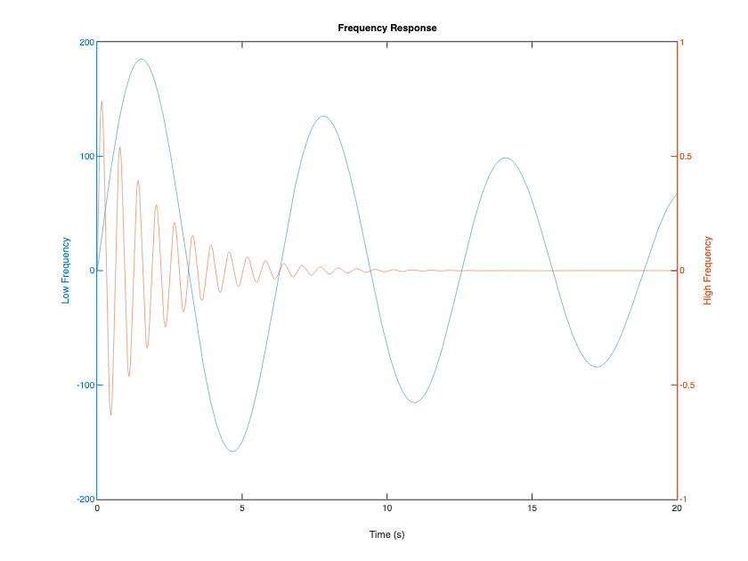

# Plotly Graphing Library for MATLAB® and GNU Octave

[](https://github.com/plotly/plotly_matlab/actions/workflows/ci.yml)
[](https://github.com/plotly/plotly_matlab/releases)

> Create interactive, web-based charts in your browser from MATLAB® and GNU Octave.

<div align="center">
  <a href="https://dash.plotly.com/project-maintenance">
    
  </a>
</div>

Version: 3.1.0

*MATLAB is a registered trademark of The MathWorks, Inc.*

## Features

- Convert native MATLAB and GNU Octave figures to interactive [Plotly](https://plotly.com) charts with a single line of code
- Fully offline: charts render locally in your browser — plotly.js is downloaded once during setup and cached on your machine
- Publication-quality static export (PNG, JPEG, PDF, SVG) via the Kaleido runtime (downloaded once during setup)
- Comparison gallery generator (`makegallery`) showing native and converted figures side by side

## Install

Download the latest version of the wrapper:

- [github.com/plotly/plotly_matlab/archive/master.zip](https://github.com/plotly/plotly_matlab/archive/master.zip)

Then, from the extracted folder, run:

```matlab
plotlysetup_offline()   % one-time setup: downloads and caches plotly.js for offline usage (requires internet once)
```

This works in both MATLAB and GNU Octave.

## Usage

Convert your MATLAB® or Octave figure into an interactive Plotly chart with a single line of code:

```matlab
% Create some data for the two curves to be plotted
x  = 0:0.01:20;
y1 = 200*exp(-0.05*x).*sin(x);
y2 = 0.8*exp(-0.5*x).*sin(10*x);

% Create a plot with 2 y axes using the plotyy function
figure;
[ax, h1, h2] = plotyy(x, y1, x, y2, 'plot');

% Add title and x axis label
xlabel('Time (s)');
title('Frequency Response');

% Use the axis handles to set the labels of the y axes
ylabel(ax(1), 'Low Frequency');
ylabel(ax(2), 'High Frequency');

%--PLOTLY--%
p = fig2plotly; % <-- converts the current figure to an interactive Plotly chart
```



The resulting figure is an interactive web chart: pan, zoom, hover, and download from the plotly.js toolbar.

## Static export

Export figures to publication-quality static images:

```matlab
p = fig2plotly;
saveplotlyfig(p, 'testimage.svg')  % PNG, JPEG, PDF, and SVG supported
```

## Online mode

Offline usage is the default and requires nothing. For online features — storing charts on the Plotly cloud, retrieving figures with `getplotlyfig`, and streaming — configure your Plotly credentials:

```matlab
plotlysetup_online('your_username', 'your_api_key')
```

## Retrieving figures

Fetch figures stored on the Plotly cloud:

```matlab
p = getplotlyfig('chris', 1638)  % downloads the graph data
```


## Gallery

Generate a side-by-side comparison of native and converted figures for over 80 plot types:

```matlab
makegallery('OutputFolder', 'gallery')
```

## Documentation

- [plotly.com/matlab](https://plotly.com/matlab) - official documentation

## Questions & troubleshooting

Ask on the [Plotly Community Forum](https://community.plotly.com/c/plotly-r-matlab-julia-net).

## Contribute

Please do! This is an open source project. Check out [the issues](https://github.com/plotly/plotly_matlab/issues) or open a PR!

We want to encourage a warm, welcoming, and safe environment for contributing to this project. See the [code of conduct](CODE_OF_CONDUCT.md) for more information.

The test suite (`plotly/testing/runplotlytests.m`) runs in both MATLAB and GNU Octave and is executed on every push via GitHub Actions.

## License

[MIT](LICENSE) © Plotly, Inc.
