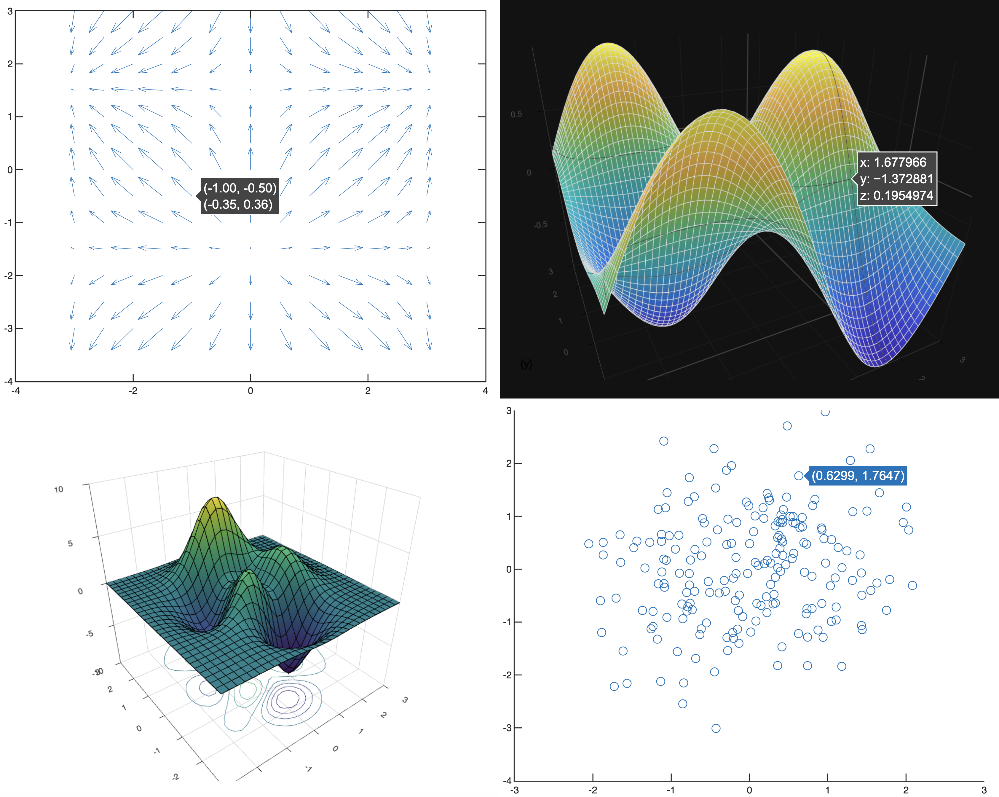

# Summary

`plotly_matlab` is the official Plotly graphing library for MATLAB and GNU Octave.
It converts native figures, created with either engine, into interactive,
web-based charts that can be explored, exported, and embedded in web pages
with a single line of code.

Interactive web-based plots play a central role in scientific research. Because
the charts are interactive, viewers can zoom and pan to inspect fine detail, and
rotate three-dimensional charts to change perspective. Hovering over data points
displays tooltips with numerical values. Because the charts are web-based, they
are easy to share between researchers on different operating systems, unlike
language-specific figure objects.

First released in 2013, this library brings interactive web-based plots to Octave and MATLAB.

# Statement of need

Plotly [@plotly] is widely used by the scientific community to generate interactive web
plots (its canonical scholarly citation has been cited more than 1,000 times on OpenAlex[^1]).
While other languages were supported by Plotly, the Octave [@octave] and MATLAB [@matlab]
ecosystems, which are widely used in scientific research, both lacked a plotting library
that is interactive and web-based. This library bridges this gap by providing an easy
way to generate Plotly figures from a broad range of native plots supported by Octave and MATLAB.

[^1]: Cited 1,061 times as of Aug 2026 (https://openalex.org/works/W2991157178)

# State of the field

Wrappers for Plotly also exist in R [@r], Python [@python], Rust [@rust], and .NET programming
languages [@dotnet], and those ecosystems have multiple interactive web-visualization
options besides Plotly. For MATLAB and Octave, the existing alternatives cover
only part of the workflow: `export_fig` [@export_fig] is a widely used tool for
high-quality static export of figures but produces no interactive charts;
`matlab2tikz` [@matlab2tikz] targets LaTeX documents with generated TikZ code;
and the `gramm` package [@gramm] provides a grammar-of-graphics interface for
statistical visualization in MATLAB but renders to native figures rather than
web charts. Rather than extending an existing binding, this library implements
figure conversion directly from each engine's native graphics object model,
providing Octave and MATLAB users with a dedicated workflow for interactive
web-based graphing.

# Software design

The core of the library is the `plotlyfig` class, which walks the graphics
object tree of a figure (figure, axes, and children) and builds a Plotly
figure description (data and layout) through per-class dispatch: a central
`updateData` function routes each graphics object to a dedicated `updateX`
function (one per supported plot type), with shared geometry and color helpers
used across plot types. hggroup-based plot types are resolved through engine-aware
group classification: both engines wrap plot types in hggroups (groups of primitive
graphics objects such as lines, patches, and text), but the group structures differ,
so the wrapper identifies the plot type behind each group before dispatch.
Three-dimensional scenes are handled explicitly, including camera geometry and
axis aspect-ratio computation derived from each engine's native camera model.

A central design commitment is cross-engine parity. MATLAB and GNU Octave
differ in their graphics object trees (e.g., Octave wraps plot types in
hggroups that MATLAB exposes differently) and property semantics (character
arrays versus string types, annotation properties absent in Octave). The library maintains
a single codebase that provides consistent behavior across both engines, with behavior
verified by a regression suite that runs on each.

Testing is an essential part of the project. A test runner
(`runplotlytests`) executes structural regression tests of converted figure
descriptions in both engines, and a gallery of 81 plot types
(`makegallery`) generates native and converted outputs that can be compared by
rendering with Plotly.js in a browser. Continuous integration runs the Octave
test suite on every push (GitHub Actions).

# Research impact statement

`plotly_matlab` is used in published scientific research. For example, it was
used to produce visualizations in a biomechanical imaging study of pelvic
floor ligaments [@MATTER2024111351]. The library is distributed through the
official Plotly MATLAB page ([plotly.com/matlab](https://plotly.com/matlab)) and the MathWorks File
Exchange. It is supported on the Plotly community forum, and has been under
active, sustained maintenance, with regular tagged releases and
extensive issue triage. The project's development history, releases, and
usage statistics are public on GitHub.

# AI usage disclosure

Gemini 3.1 Pro was used exclusively as assistance in the writing of this
manuscript for structure and clarity. All AI suggestions were reviewed and
validated by the authors. The authors made all decisions and verified technical accuracy.

# Acknowledgements

The library was originally created by Chuck Bronson and has benefited from
contributions by many other contributors. R. Moura currently maintains the
library in his personal time and receives no funding for this work.
C. Parmer is a co-founder and the chief product officer (CPO) of Plotly
Technologies Inc.; the library's early
development was carried out by Plotly employees, and G. Galvis's 2021
contributions were made under contract for Plotly. He has no current
financial or contractual relationship with the company. The authors thank
Plotly Technologies Inc. for supporting the open-source development of the
Plotly ecosystem.

# References
